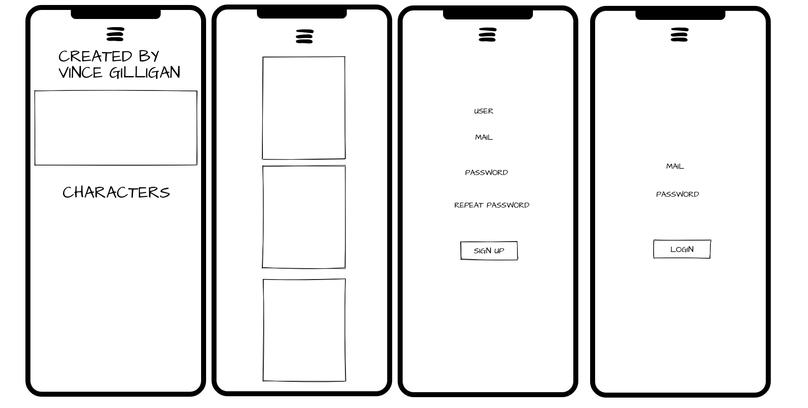

# BREAKING BAD

##### 

## Minimum Viable Product

The **MVP** will cover the following:

- **Dashboard**: Will present all Breaking Bad Seasons with the chapters inside.
- **FAQ**: Everything you need about Breaking Bad. Ask page.
- **Signup**: A registration form for new users.
- **Login**: A sign in form for existing users.

### Data Structure

- Root/

  - index.html
  - signup.html
  - faq.html
  - login.html
  - dashboard.html
  - css/
    - style.css
    - burger.css
  - Scripts/
    - Login.js
    - Signup.js
    - Database.js
    - User.js
    - Validator.js
    - bbApiService.js
  - img/

  #### Trello

  [Trello Kanban board](https://trello.com/b/gNf2syne/first-project-sergi-b)

  #### Git

 [Github Repo URL](https://github.com/sbotargues/breakingbad)

[Deployed](https://sbotargues.github.io/breakingbad/)

  #### Breaking bad API
[Api Documentation](https://breakingbadapi.com/documentation)

  
